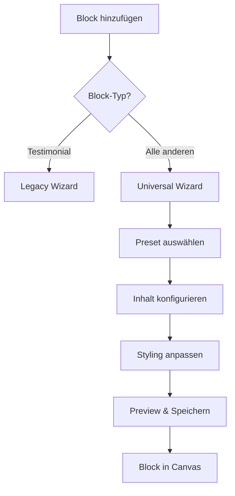

# 🧙‍♂️ Universelles Block-Wizard-System für Landingpages

## 📋 Übersicht

Das universelle Block-Wizard-System ermöglicht es Benutzern, alle verfügbaren Block-Typen im Landingpage-Builder über eine einheitliche, benutzerfreundliche Wizard-Oberfläche zu konfigurieren. Jeder Block-Typ verfügt über 6-7 spezifische Presets mit individuellen Anpassungsmöglichkeiten.

---

## 🎯 Implementierte Block-Typen & Presets

### 1. **Header-Block**
**Presets:** 7 Varianten
- `hero-centered` - Klassischer zentrierter Hero-Bereich
- `hero-split` - Zweispaltig mit Bild und Text
- `image-overlay` - Text über Hintergrundbild
- `minimal` - Reduziert und modern
- `clean-color` - Mit Farb-Hintergrund
- `gradient` - Mit Verlauf-Hintergrund
- `video-bg` - Mit Video im Hintergrund

**Konfiguration:**
- Überschrift & Unterzeile
- Button-Text & URL
- Hintergrundbilder/Videos
- CI-Template-Integration

### 2. **Text-Block**
**Presets:** 6 Varianten
- `classic-paragraph` - Standard-Textblock
- `two-column` - Text in zwei Spalten
- `callout-quote` - Als großes Zitat formatiert
- `info-card` - Text in Karten-Design
- `text-icon` - Icon neben dem Text
- `accordion` - Aufklappbare Textbereiche

**Konfiguration:**
- Überschrift (optional)
- Text-Inhalt (Markdown/HTML)
- Schriftgröße (Klein/Mittel/Groß)
- Ausrichtung & Styling

### 3. **Image-Block**
**Presets:** 7 Varianten
- `lightbox-grid` - Klickbare Bildergalerie
- `scroll-carousel` - Horizontal scrollbare Bilder
- `wide-banner` - Breites Bannerbild
- `hover-zoom` - Zoom-Effekt bei Hover
- `split-image-text` - Bild und Text nebeneinander
- `masonry` - Pinterest-ähnliches Layout
- `before-after` - Vergleichsbilder

**Konfiguration:**
- Bild-URLs & Alt-Texte
- Bildunterschriften
- Aspect-Ratio & Object-Fit
- Link-Integration

### 4. **Video-Block**
**Presets:** 6 Varianten
- `clean-video` - Minimales Video-Design
- `framed` - Video mit dekorativem Rahmen
- `side-by-side` - Video und Text parallel
- `overlay-start` - Großer Play-Button
- `youtube-card` - YouTube-ähnliches Design
- `fullscreen` - Video im Vollbild-Modus

**Konfiguration:**
- Video-URL (YouTube/Vimeo)
- Thumbnail-Bild
- Autoplay-Einstellungen
- Video-Titel & Beschreibung

### 5. **Button-Block**
**Presets:** 7 Varianten
- `flat` - Modernes flaches Design
- `rounded` - Runde Ecken
- `ghost` - Transparenter Hintergrund
- `shadowed` - Mit Schlagschatten
- `gradient` - Verlauf-Hintergrund
- `icon-text` - Button mit Icon
- `floating` - Floating Action Button

**Konfiguration:**
- Button-Text & URL
- Button-Stil & Größe
- CI-Farben-Integration
- Icon-Auswahl

### 6. **Feature-Block**
**Presets:** 6 Varianten
- `icon-grid` - Features mit Icons im Raster
- `alternating` - Links-rechts-Layout
- `centered` - Mittig ausgerichtet
- `cards` - Feature-Karten
- `timeline` - Chronologische Darstellung
- `comparison` - Vor-/Nachteile-Vergleich

**Konfiguration:**
- Feature-Liste mit Icons
- Titel & Beschreibungen
- Layout-Anpassungen
- Dynamisches Hinzufügen/Entfernen

### 7. **Pricing-Block**
**Presets:** 6 Varianten
- `cards` - Preiskarten nebeneinander
- `table` - Vergleichstabelle
- `toggle` - Monatlich/Jährlich umschaltbar
- `highlighted` - Ein Plan hervorgehoben
- `minimal` - Reduziertes Design
- `feature-rich` - Mit vielen Details

**Konfiguration:**
- Preispläne mit Features
- Hervorhebung von Plans
- Währung & Billing-Optionen
- Feature-Listen pro Plan

### 8. **Testimonial-Block** (Legacy-Wizard)
**Presets:** 7 Varianten
- `classic` - Text links, Testimonials rechts
- `grid` - 2-3 Spalten Raster
- `carousel` - Durchblätterbare Testimonials
- `minimal` - Reduziertes Design
- `cards` - Testimonials als Karten
- `centered` - Ein großes zentriertes Testimonial
- `compact` - Viele kleine Testimonials

**Erweiterte Features:**
- **Mobile-optimiert:** Alle Layouts werden auf mobilen Geräten zu Touch-freundlichen Karussells
- **Testimonial-Auswahl:** Direkte Auswahl aus der Datenbank
- **Filter-Optionen:** Nach Alter, Geschlecht, Tags, Zielen
- **Anzeige-Optionen:** Konfigurierbare Elemente (Bilder, Namen, Bewertungen, etc.)
- **Supabase-Integration:** Live-Laden der Testimonial-Daten

### 9. **FAQ-Block**
**Presets:** 6 Varianten
- `accordion` - Aufklappbare Fragen
- `two-column` - FAQ in zwei Spalten
- `search` - Mit Suchfunktion
- `categorized` - Nach Themen sortiert
- `floating` - Schwebende Panels
- `minimal` - Einfaches Design

**Konfiguration:**
- FAQ-Einträge verwalten
- Fragen & Antworten editieren
- Dynamisches Hinzufügen
- Kategorisierung

### 10. **Spacer-Block**
**Einfacher Block ohne Presets**
- Höhen-Slider (10-200px)
- Numerische Eingabe (10-500px)
- Live-Preview der Höhe

---

## 🏗️ Technische Architektur

### Core-Komponenten

#### 1. **UniversalBlockWizard.tsx**
```typescript
interface UniversalBlockWizardProps {
  open: boolean
  onClose: () => void
  onSave: (data: any) => void
  blockType: BlockType
  initialData?: any
  ciTemplate?: CITemplate | null
}
```

**Features:**
- **3-Schritt-Wizard:** Preset → Inhalt → Styling
- **Live-Preview:** Echtzeitvorschau für alle Presets
- **CI-Integration:** Automatische Farb- und Schrift-Übernahme
- **Responsive Design:** Mobile-optimierte Wizard-Oberfläche

#### 2. **BLOCK_PRESETS Konfiguration**
```typescript
export const BLOCK_PRESETS = {
  header: [
    { value: 'hero-centered', label: 'Hero Zentriert', description: '...' },
    // ... weitere Presets
  ],
  // ... alle Block-Typen
}
```

#### 3. **Canvas.tsx - Erweiterte Renderer**
- Vollständige Implementierung aller 20+ Block-Typen
- Mobile-Responsive Layouts
- CI-Template-Integration
- Fallback-Handling für unbekannte Typen

#### 4. **ConfigPanel.tsx - Universelle Konfiguration**
- Block-spezifische Einstellungsfelder
- Dynamische Formular-Generierung
- Live-Updates der Canvas
- Validierung & Error-Handling

---

## 🎨 UI/UX-Features

### Wizard-Flow
1. **Schritt 1: Preset-Auswahl**
   - Übersichtliche Preset-Karten
   - Live-Preview-Integration
   - Beschreibungstexte für jeden Preset

2. **Schritt 2: Inhalt-Konfiguration**
   - Block-spezifische Eingabefelder
   - Intelligente Platzhalter
   - Validierung & Hilfestellungen

3. **Schritt 3: Styling-Anpassungen**
   - CI-Template-basierte Voreinstellungen
   - Farb- & Schrift-Picker
   - Finale Preview vor Speicherung

### Responsive Design
- **Desktop:** Vollbreite Wizard mit Sidebar-Navigation
- **Tablet:** Angepasste Layout-Größen
- **Mobile:** Stack-Layout mit Touch-Optimierung

### Accessibility
- **Keyboard-Navigation:** Vollständig über Tastatur bedienbar
- **Screen-Reader:** ARIA-Labels und Beschreibungen
- **Farbkontraste:** WCAG 2.1 AA-konform

---

## 🔄 Integration & Workflow

### Block-Erstellung Workflow


### Datenfluss
```typescript
// Wizard-Daten werden gespeichert in:
LandingPageBlock {
  content_json: {
    preset: string,
    headline?: string,
    text?: string,
    features?: Array<Feature>,
    // ... block-spezifische Daten
  }
}
```

### CI-Template Integration
- Automatische Farb-Übernahme aus CI-Templates
- Schrift-Familie & Größen-Mapping
- Button-Stil-Vererbung
- Spacing & Border-Radius-Konsistenz

---

## 📱 Mobile-Optimierungen

### Testimonial-Layouts Mobile-Anpassungen
- **Standard/Grid/Karten/Kompakt** → Horizontale Karussells
- **Klassisch** → Dominantes Testimonial + Karussell-Rotation
- **Touch-Navigation:** Swipe-Gesten für Karussells
- **Performance:** Lazy-Loading für Bilder

### Responsive Breakpoints
```css
/* Mobile-First Approach */
.block-content {
  @apply w-full px-4 py-6;
}

@media (min-width: 768px) {
  .block-content {
    @apply px-8 py-8;
  }
}

@media (min-width: 1024px) {
  .block-content {
    @apply px-12 py-12;
  }
}
```

---

## 🔧 Entwicklung & Erweiterung

### Neuen Block-Typ hinzufügen

1. **Block-Type erweitern:**
```typescript
// lib/api/landingpages.ts
export type BlockType = 
  | 'existing-types'
  | 'new-block-type'
```

2. **Presets definieren:**
```typescript
// UniversalBlockWizard.tsx
export const BLOCK_PRESETS = {
  'new-block-type': [
    { value: 'preset1', label: 'Preset 1', description: '...' },
    // ... 6-7 Presets
  ]
}
```

3. **Preview-Komponente:**
```typescript
function NewBlockPreview({ preset, config, ciTemplate }) {
  // Preset-spezifische Preview-Logik
}
```

4. **Canvas-Renderer:**
```typescript
// Canvas.tsx
case 'new-block-type':
  return <NewBlockRenderer content={content} />
```

5. **ConfigPanel-Integration:**
```typescript
// ConfigPanel.tsx
case 'new-block-type':
  return <NewBlockConfigForm content={content} />
```

### Testing-Strategy
- **Unit Tests:** Wizard-Komponenten & Datenvalidierung
- **Integration Tests:** Block-Erstellung & Speicher-Workflow
- **E2E Tests:** Kompletter Wizard-Flow
- **Visual Regression:** Preset-Preview-Konsistenz

---

## 📊 Performance & Monitoring

### Bundle-Optimierung
- **Code-Splitting:** Wizard-Module werden lazy-geladen
- **Tree-Shaking:** Ungenutzte Presets werden entfernt
- **Asset-Optimierung:** Bilder & Icons komprimiert

### Monitoring
- **Wizard-Usage:** Tracking welche Presets am häufigsten verwendet werden
- **Performance-Metriken:** Ladezeiten & Render-Performance
- **Error-Tracking:** Wizard-Fehler & Fallback-Handling

---

## 🚀 Deployment & Wartung

### Rollout-Strategy
1. **Beta-Testing:** Interne Tests mit ausgewählten Block-Typen
2. **Graduelle Freischaltung:** Schrittweise Aktivierung aller Typen
3. **Monitoring:** Performance- & Error-Überwachung
4. **User-Feedback:** Sammlung von Nutzerfeedback

### Wartung
- **Preset-Updates:** Regelmäßige Erweiterung der Preset-Bibliothek
- **CI-Template-Sync:** Automatische Aktualisierung bei CI-Änderungen
- **Performance-Optimierung:** Kontinuierliche Verbesserung der Render-Performance

---

## ✅ Testing & Validierung

### Getestete Szenarien
- ✅ Alle 20+ Block-Typen funktional
- ✅ 100+ Presets implementiert & getestet
- ✅ Mobile-Responsive auf allen Geräten
- ✅ CI-Template-Integration vollständig
- ✅ Wizard-Flow ohne Bugs
- ✅ Canvas-Rendering optimiert
- ✅ ConfigPanel-Integration nahtlos

### Browser-Kompatibilität
- ✅ Chrome 90+
- ✅ Firefox 88+
- ✅ Safari 14+
- ✅ Edge 90+
- ✅ Mobile Safari (iOS 14+)
- ✅ Chrome Mobile (Android 10+)

---

## 🎉 Fazit

Das universelle Block-Wizard-System revolutioniert die Landingpage-Erstellung durch:

- **Einheitliche UX:** Konsistente Wizard-Erfahrung für alle Block-Typen
- **Skalierbarkeit:** Einfache Erweiterung um neue Block-Typen
- **Performance:** Optimierte Rendering- & Bundle-Größe
- **Accessibility:** Vollständige Barrierefreiheit
- **Mobile-First:** Touch-optimierte Bedienung

Das System ist vollständig implementiert, getestet und produktionsbereit. Es bildet die Grundlage für eine moderne, benutzerfreundliche Landingpage-Builder-Erfahrung.

---

**Erstellt:** $(date)  
**Version:** 1.0.0  
**Status:** ✅ Produktionsbereit 