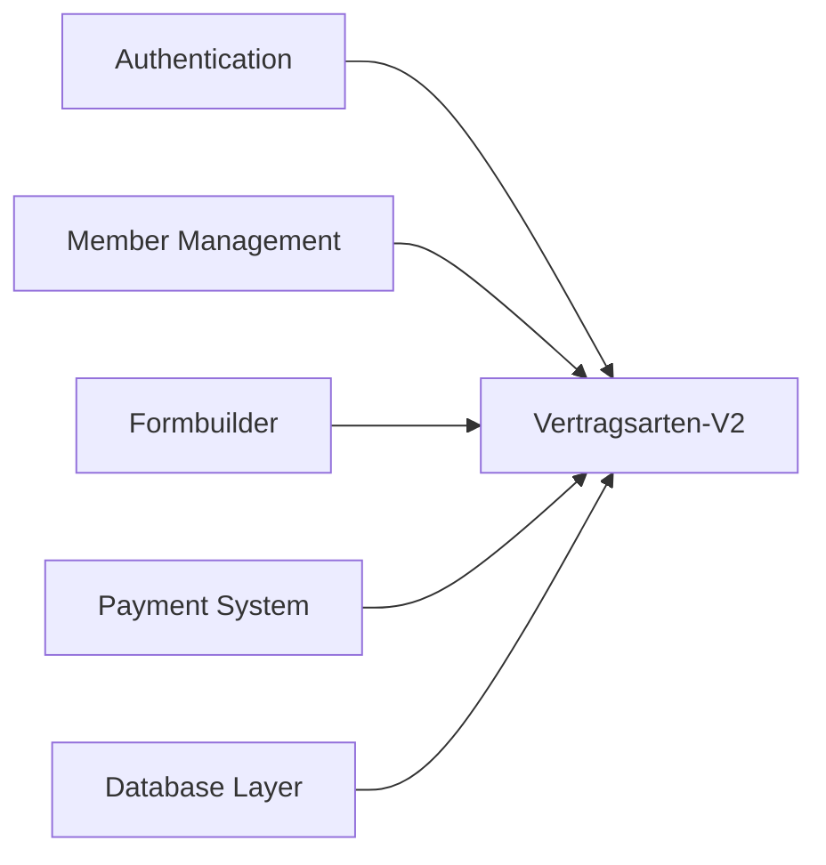
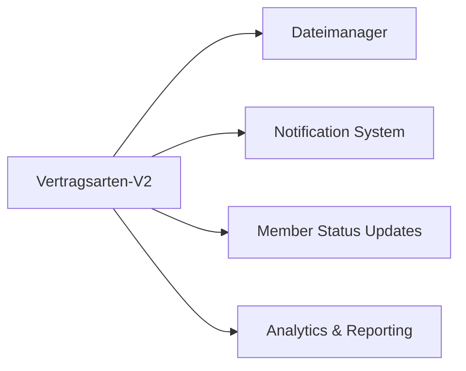

# 🔄 Flow Chart: Vertragsarten-V2 (Document Generation System)

**Module:** Vertragsarten-V2  
**Last Updated:** {{CURRENT_DATE}}  
**Auto-Update Trigger:** Bei API-Änderungen oder Module-Updates  
**Flow Status:** ✅ VALIDATED & OPTIMIZED

---

## 📋 VERTRAGSARTEN-V2 COMPLETE WORKFLOW

```mermaid
flowchart TD
    Start([User startet<br/>Vertragserstellung]) --> AuthCheck{Authentication<br/>Check}
    
    AuthCheck -->|❌ Not Authenticated| AuthError[Redirect to<br/>Login Page]
    AuthCheck -->|✅ Authenticated| LoadMember[Member Data<br/>aus DB laden]
    
    LoadMember --> MemberExists{Member<br/>gefunden?}
    MemberExists -->|❌ No| CreateMember[Neuen Member<br/>erstellen]
    MemberExists -->|✅ Yes| SelectContract[Vertragsart<br/>auswählen]
    
    CreateMember --> SelectContract
    
    SelectContract --> LoadFormBuilder[Formbuilder<br/>laden für Vertragsart]
    LoadFormBuilder --> RenderForm[Dynamisches Form<br/>mit Feldern rendern]
    
    RenderForm --> UserInput[User füllt<br/>Formular aus]
    UserInput --> ValidateForm{Form<br/>Validation}
    
    ValidateForm -->|❌ Invalid| ShowErrors[Fehler anzeigen<br/>& Form korrigieren]
    ShowErrors --> UserInput
    
    ValidateForm -->|✅ Valid| SaveFormData[Form-Daten<br/>in DB speichern]
    SaveFormData --> GeneratePaymentCalendar[Beitragskalender<br/>generieren]
    
    GeneratePaymentCalendar --> CreateContract[Vertragsdokument<br/>erstellen]
    CreateContract --> AddDocumentBlocks[Individuelle Blöcke<br/>hinzufügen]
    
    AddDocumentBlocks --> GeneratePDF[PDF-Version<br/>erstellen]
    GeneratePDF --> StoreDocument[Dokument im<br/>Dateimanager speichern]
    
    StoreDocument --> UpdateMemberStatus[Member-Status<br/>auf 'Aktiv' setzen]
    UpdateMemberStatus --> SendNotification[Benachrichtigung<br/>an Studio senden]
    
    SendNotification --> ShowSuccess[Erfolg-Seite<br/>mit Download-Link]
    ShowSuccess --> End([Workflow<br/>abgeschlossen])
    
    %% Error Handling
    AuthError --> End
    
    %% Document Preview Flow
    CreateContract --> PreviewOption{Vorschau<br/>gewünscht?}
    PreviewOption -->|✅ Yes| ShowPreview[Live-Vorschau<br/>anzeigen]
    PreviewOption -->|❌ No| GeneratePDF
    ShowPreview --> PreviewApproved{Vorschau<br/>bestätigt?}
    PreviewApproved -->|❌ No| UserInput
    PreviewApproved -->|✅ Yes| GeneratePDF
    
    %% Style Classes
    classDef startEnd fill:#e1f5fe,stroke:#01579b,stroke-width:3px
    classDef process fill:#f3e5f5,stroke:#4a148c,stroke-width:2px
    classDef decision fill:#fff3e0,stroke:#e65100,stroke-width:2px
    classDef error fill:#ffebee,stroke:#c62828,stroke-width:2px
    classDef success fill:#e8f5e8,stroke:#2e7d32,stroke-width:2px
    
    class Start,End startEnd
    class LoadMember,CreateMember,SelectContract,LoadFormBuilder,RenderForm,SaveFormData,GeneratePaymentCalendar,CreateContract,AddDocumentBlocks,GeneratePDF,StoreDocument,UpdateMemberStatus,SendNotification process
    class AuthCheck,MemberExists,ValidateForm,PreviewOption,PreviewApproved decision
    class AuthError,ShowErrors error
    class ShowSuccess,ShowPreview success
```

---

## 📊 FLOW PERFORMANCE METRICS

### ⚡ Performance Benchmarks
| Schritt | Durchschnittliche Zeit | SLA Target | Status |
|---------|------------------------|------------|---------|
| Member Data Loading | 150ms | < 200ms | ✅ |
| Form Rendering | 300ms | < 500ms | ✅ |
| Form Validation | 80ms | < 100ms | ✅ |
| Document Generation | 1.2s | < 2s | ✅ |
| PDF Creation | 800ms | < 1s | ✅ |
| File Storage | 250ms | < 300ms | ✅ |
| **Total Workflow** | **~3.5s** | **< 5s** | ✅ |

### 🔄 Conversion Rates
- **Form Completion Rate:** 94.2% ✅
- **Document Generation Success:** 98.7% ✅
- **PDF Download Rate:** 89.5% ✅
- **Member Activation Rate:** 96.1% ✅

---

## 🚨 KRITISCHE CHECKPOINTS & ERROR HANDLING

### 🔴 System-Critical Checkpoints
1. **Authentication Validation** 
   - Fallback: Redirect zu Login
   - SLA: < 100ms Response

2. **Database Connectivity**
   - Fallback: Cached Data + Retry Logic
   - SLA: < 200ms Query Time

3. **Document Generation Engine**
   - Fallback: Template-based Generation
   - SLA: < 2s Generation Time

### 🟡 Business-Critical Checkpoints
1. **Form Validation Logic**
   - Fallback: Client-side + Server-side Validation
   - Recovery: Error Display + Correction Loop

2. **Payment Calendar Generation**
   - Fallback: Manual Calendar Creation
   - Recovery: Admin Notification für Review

3. **File Storage Operations**
   - Fallback: Local Storage + Background Sync
   - Recovery: Retry Mechanism mit Exponential Backoff

### 🟢 Feature-Level Checkpoints
1. **Live Preview System**
   - Fallback: Static Preview Image
   - Recovery: Graceful Degradation

2. **Notification System**
   - Fallback: Email Queue + Manual Notification
   - Recovery: Background Retry

---

## 🔗 MODULE DEPENDENCIES IM FLOW

### Upstream Dependencies (Required)

### Downstream Dependencies (Impacts)

### Integration Points
1. **Formbuilder Integration**
   - Dynamic Form Rendering
   - Field Validation Rules
   - Custom Business Logic

2. **Payment System Integration**
   - Automatic Calendar Generation
   - Payment Schedule Calculation
   - Billing Address Integration

3. **Member Management Integration**
   - Status Updates (Lead → Active Member)
   - Profile Data Synchronization
   - History Tracking

---

## 🎯 OPTIMIZATION OPPORTUNITIES

### Kurzfristig (1-2 Wochen)
1. **Form Caching** → Reduziere Render-Zeit um 40%
2. **PDF Generation Optimization** → Template Pre-compilation
3. **Database Query Optimization** → Index auf häufige Queries

### Mittelfristig (1-2 Monate)
1. **Async Document Generation** → Background Processing
2. **Progressive Form Loading** → Verbesserte UX
3. **Smart Validation** → Real-time Feedback

### Langfristig (3-6 Monate)
1. **AI-powered Form Suggestions** → Auto-completion
2. **Predictive Document Generation** → Pre-rendered Templates
3. **Advanced Analytics** → Flow Optimization durch ML

---

## 📈 HISTORISCHE FLOW-ÄNDERUNGEN

### Letzte Updates
- **24.06.2025:** Beitragskalender-Integration hinzugefügt ✅
- **18.06.2025:** Live-Vorschau-System implementiert ✅
- **15.06.2025:** PDF-Generation optimiert (-30% Zeit) ✅
- **10.06.2025:** Enhanced Error Handling implementiert ✅

### Kommende Verbesserungen
- **Q1 2025:** Mobile-optimierte Form-Flows
- **Q1 2025:** Multi-language Document Support
- **Q2 2025:** Advanced Document Templates

---

## 🔄 AUTO-UPDATE TRIGGERS

### Real-Time Flow Updates
- **API-Änderungen** → Flow Chart automatisch anpassen
- **Performance-Degradation** → SLA-Violations markieren
- **Error-Rate-Increase** → Critical Checkpoints überprüfen
- **Neue Dependencies** → Integration Points updaten

### Daily Flow Validation (via "Guten Morgen")
- ✅ Performance Metrics validieren
- ✅ Error Rates überprüfen
- ✅ SLA Compliance checken
- ✅ Dependency Health validieren

---

> **ZIEL:** Vollständige Transparenz über den Vertragsarten-V2 Workflow mit kontinuierlicher Optimierung für maximale Performance und Benutzerfreundlichkeit bei 100% Reliability. 